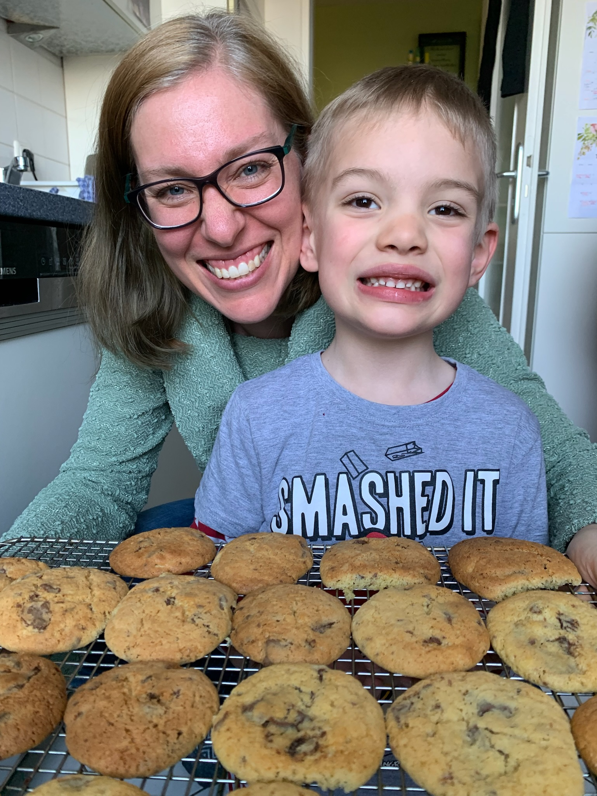

## Interkulturelle Kommunikationswege in sich wandelnden religiösen Umfeldern

### Vergleichende Untersuchungen

Sommersemester 2023  
Prof. Dr. Nathan Gibson

## Vorstellungen

### Wer bin ich?

## Wer sind Sie?

Name:  
Studiengang/Jahr:  
Wofür hier:  
Nichtwissenschaftliche Interessen:  

::: notes

Designate a student if late.

:::

## Nur für sich

Ihre Ziele: 

- inhaltlich: z.B. etwas fremd, mit dem Sie sich bekannt machen wollen
{: .fragment}
- wissenschaftliche Kompetenzen: z.B. beim Lesen, Schreiben, Literaturrecherche, Zeitmanagement
{: .fragment}
- sozial: z.B. Führungspotenzial weiterentwickeln, effektivere Zusammenarbeit
{: .fragment}
- seelisch: z.B. mutig mit harten Fragen umgehen
{: .fragment}

## Spiel: Wer ist das?

Source: https://edition.cnn.com/2014/01/23/living/gallery/religious-celebs/index.html

## "I'm definitely a practicing Hindu."

- Julia Roberts
{: .fragment}
- Kevin Hart
{: .fragment}
- Anupam Kher
{: .fragment}
- Justin Bieber
{: .fragment}

Julia Roberts
{: .fragment}

{: .fragment style="height: 300px; margin: auto"}

## Doesn't do social media on the Sabbath?

- Joseph Gordon-Levitt
{: .fragment}
- Mayim Bialik
{: .fragment}
- Katharine Hepburn
{: .fragment}
- Miley Cyrus
{: .fragment}

Mayim Bialik (Big Bang Theory)
{: .fragment}

{: .fragment style="height: 300px; margin: auto"}

## Has gone door-to-door to share beliefs as a Jehovah's Witness?

- Prince
{: .fragment}
- Oprah Winfrey
{: .fragment}
- Taylor Swift
{: .fragment}
- Tom Cruise
{: .fragment}

Prince
{: .fragment}

{: .fragment style="height: 300px; margin: auto"}

## "Allah doesn't need me; I need Allah."

- Jennifer Aniston
{: .fragment}
- Queen Latifah
{: .fragment}
- Daniel Radcliffe
{: .fragment}
- Mike Tyson
{: .fragment}

Mike Tyson
{: .fragment}

{: .fragment style="height: 300px; margin: auto"}

## "reads the Bible every day"

- Denzel Washington
{: .fragment}
- Gal Gadot
{: .fragment}
- Idris Elba
{: .fragment}
- Lebron James
{: .fragment}

Denzel Washington
{: .fragment}

{: .fragment style="height: 300px; margin: auto"}

## Taught in a Tibetan monastery and is a "philosophical" Buddhist.

- Chris Pratt
{: .fragment}
- Elon Musk
{: .fragment}
- Steven Spielberg
{: .fragment}
- Benedict Cumberbatch
{: .fragment}

Benedict Cumberbatch
{: .fragment}

{: .fragment style="height: 300px; margin: auto"}

Source: https://www.hollywoodreporter.com/movies/movie-news/benedict-cumberbatch-confessions-fifth-estate-625408/
{: .fragment}

## Religionswissenschaft

eine gefährliche Disziplin

## Lehrplan: Wichtige Links

(meistens mit **23interkulturelle**)

- Website: [https://**23interkulturelle**.pages.gwdg.de/](https://23interkulturelle.pages.gwdg.de/)  
- OLAT: [https://olat-ce.server.uni-frankfurt.de/olat/auth/RepositoryEntry/18072600580](https://olat-ce.server.uni-frankfurt.de/olat/auth/RepositoryEntry/18072600580)  
- Zotero: [https://zotero.org/groups/**23interkulturelle**/library](https://zotero.org/groups/23interkulturelle/library)
- Etherpad: [https://etherpad.studiumdigitale.uni-frankfurt.de/p/**23interkulturelle**1](https://etherpad.studiumdigitale.uni-frankfurt.de/p/23interkulturelle1) (_am Ende 2, 3 usw. für jede Sitzung_)
- Chat: [https://chat.studiumdigitale.uni-frankfurt.de/channel/23interkulturelle](https://chat.studiumdigitale.uni-frankfurt.de/channel/23interkulturelle) 

## Lehrplan: Sprechstunden

Büro: IG-Farben-Haus 6.552  

- Mittwoch 10–11 Uhr (ohne Termin)
- Mittwoch 11–12 Uhr (mit Termin, Terminbuchung auf [npgibson.com/m/sprechstunden](http://npgibson.com/m/sprechstunden))
- Freitag 13–14 Uhr (per **Zoom** mit Termin, Terminbuchung auf [npgibson.com/m/sprechstunden-zoom](http://npgibson.com/m/sprechstunden-zoom))

## Cookies!

{: style="height: 500px"}

Chocolate-chip hazelnut

## Lehrplan: Hintergrund & Zielsetzung

Ziel ist es, (1) die sozialen und kulturellen Dimensionen des religiösen Wandels zu verstehen, die die Vergangenheit und die Gegenwart miteinander verbinden, und (2) die Studierenden darauf vorzubereiten, diese Dimensionen bei ihrer Arbeit in den religiösen, kulturellen und Entwicklungssektoren zu berücksichtigen.

## Lehrplan: Erwartungen

- Anwesenheit
- Lektüren
- Diskussionen
- respektvoller Umgang

### Was sind Ihre Erwartungen?
{: .fragment}

[https://etherpad.studiumdigitale.uni-frankfurt.de/p/23interkulturelle1](https://etherpad.studiumdigitale.uni-frankfurt.de/p/23interkulturelle1)
{: .fragment}

## Lehrplan: Prüfungsleistungen und Prüfungsform

- Abfrage

## Lehrplan: Zeitplan und Lektüren

S. [https://23interkulturelle.pages.gwdg.de/](https://23interkulturelle.pages.gwdg.de/)  

- meistens verlinkt über die UB mit HRZ-Login
- Alle Literature auf [https://www.zotero.org/groups/23interkulturelle/library](https://www.zotero.org/groups/23interkulturelle/library)

## Lehrplan: Inklusion, Barrierefreiheit und Unterstützung

- Vielseitige Beratungsangebote: [https://www.uni-frankfurt.de/91919538/Beratung__\_Unterst%C3%BCtzung](https://www.uni-frankfurt.de/91919538/Beratung___Unterst%C3%BCtzung)
- Barrierefreiheit beim Studium: [https://www.uni-frankfurt.de/83577918/Wege_zu_Studium_und_Beruf_ohne_Barrieren__\_Willkommen](https://www.uni-frankfurt.de/83577918/Wege_zu_Studium_und_Beruf_ohne_Barrieren___Willkommen)
- Psychotherapeutische Beratung: [https://www.uni-frankfurt.de/120593878/Angebote_der_PBS](https://www.uni-frankfurt.de/120593878/Angebote_der_PBS)

## Lehrplan: Hausarbeiten

- Beratungstermin bei mir buchen
- **Keine Plagiate!**
- Schreibkompetenz mithilfe des Schreibzentrums ausrüsten: [https://www.starkerstart.uni-frankfurt.de/82728115/Schreibberatung](https://www.starkerstart.uni-frankfurt.de/82728115/Schreibberatung)

## Sprache

## Vorschau nächste Sitzung