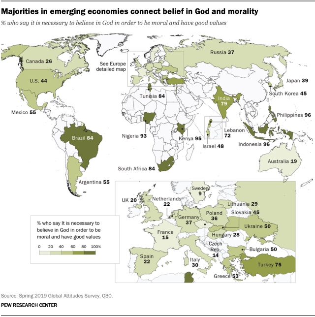
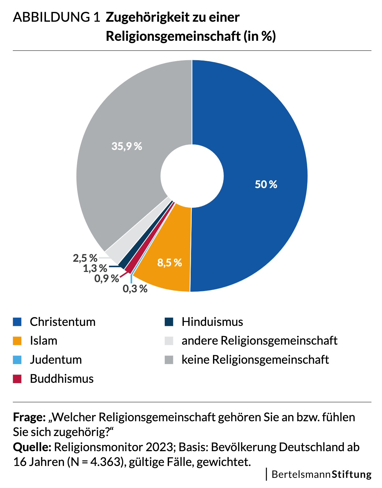
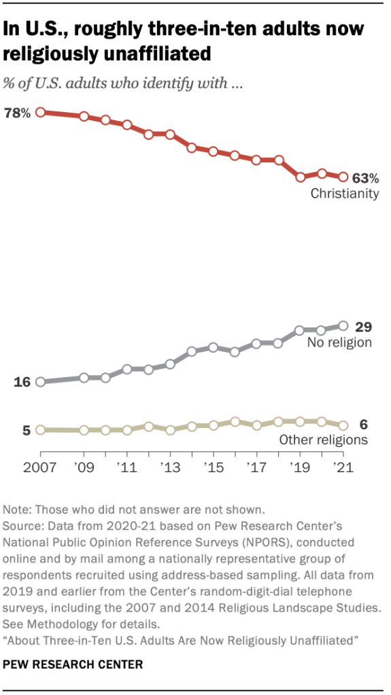

## Leaving a Religion and Non-Affiliation

### Interkulturelle Kommunikationswege in sich wandelnden religiösen Umfeldern

Sommersemester 2023  
Prof. Dr. Nathan Gibson

## Sprechstunden

morgen 10-12 (nur per Zoom)  
<http://npgibson.com/m/sprechstunden-zoom>

<!-- ## Upcoming 

-  -->

## 📈 Review

- letztes Lernziel: Name some ways religious affiliation is maintained and continued across multiple generations and cultures.
- Praktiken, die bei der religiöser Kontinuität involviert sind
  - nach der Einwanderung/Auswanderung
  - in der Familie unter jüngeren Generationen
  - durch die Einbeziehung von neuen Leuten (Recruiting)

## 📈 Review

- Kulturell-religiöse Sichten von Türkeistämmigen in DE
  - zwischen Generationen: kulturelle Identität, religiöse Praktiken vs. Spiritualität

## 🧭 Heutiges Lernziel

Discuss whether leaving a religion is a process similar to conversion.

## Einleitung

Source: [Pew Research 2020](https://www.pewresearch.org/global/2020/07/20/the-global-god-divide/pg_2020-07-20_global-religion_0-01/)

## Einleitung

 
{: style="height: 500px; margin: auto"}

Source: [Religionsmonitor 2023](https://www.bertelsmann-stiftung.de/de/unsere-projekte/religionsmonitor/projektnachrichten/so-gelingt-religioese-vielfalt-durch-kontakt-zueinander)

## Einleitung

{: style="height: 500px; margin: auto"}

Source: [Pew Research 2021](https://www.pewresearch.org/religion/2021/12/14/about-three-in-ten-u-s-adults-are-now-religiously-unaffiliated/)

## Einleitung

- content vs. form
- religious vs. spiritual

## Group Work

<https://etherpad.studiumdigitale.uni-frankfurt.de/p/23interkulturelle9>

## Diskussion 

- Lektüre (Hood et al.)
- Beispiele? 

## Preview

<https://23interkulturelle.pages.gwdg.de/10>

